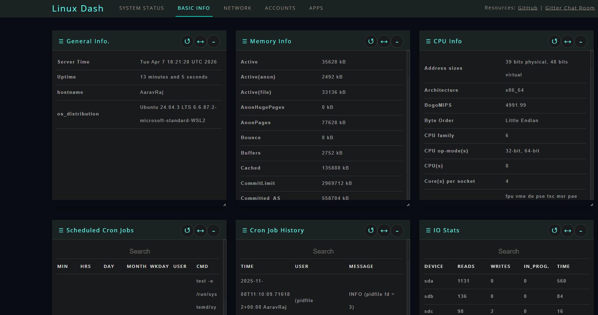

KernelPulse 🐧
A High-Performance, Modern Web Dashboard for Linux Systems
KernelPulse is a lightweight, low-overhead monitoring solution designed to provide real-time insights into Linux server health. This project is a modernized evolution of the classic linux-dash, featuring a complete UI/UX overhaul and a standardized backend API for the next generation of sysadmin tools.

A sleek, glassmorphic interface featuring real-time CPU, Memory, and Network telemetry.

🚀 Why KernelPulse?
While traditional monitoring tools can be heavy and complex, KernelPulse stays true to a minimalist philosophy while providing a premium visual experience.

Key Enhancements
Modern Aesthetics: A fully redesigned frontend utilizing Glassmorphism and high-contrast dark themes for superior readability.

Standardized API: Refactored backend shell scripts to utilize lowercase JSON keys (e.g., os_distribution, hostname), ensuring seamless data binding with modern JavaScript frameworks.

Reactive Visuals: Legacy progress bars have been replaced with dynamic circular gauges and real-time sparklines for a more intuitive data "pulse."

Low Resource Footprint: Designed to run efficiently on everything from high-end enterprise servers to low-power Raspberry Pi units.

🛠 Installation & Setup
Prerequisites
Python 3.x

Linux Environment (Ubuntu, Debian, CentOS, RHEL, Arch, etc.)

lsb-release (Required for accurate distribution detection)

Quick Start
Bash
# 1. Clone the repository
git clone https://github.com/pickaboo10/KernelPulse.git

# 2. Navigate to the server directory
cd KernelPulse/app/server

# 3. Grant execution permissions to the data-gathering script
chmod +x linux_json_api.sh

# 4. Launch the backend (defaults to port 8080)
python3 index.py
📊 Feature Breakdown
System Status: Live monitoring of CPU Load Average, RAM utilization, and Disk partitions.

Network Activity: Real-time tracking of upload/download speeds and interface status.

Process Management: Detailed overview of active system processes sorted by resource intensity.

System Identity: Instant reporting of Kernel version, OS distribution, and Hostname.

⚙️ Technical Notes & Troubleshooting
Port Configuration: If you wish to run KernelPulse on the standard HTTP port (80), you may need to use sudo:

Bash
sudo python3 index.py
OS Detection: If your distribution is not appearing correctly, ensure the lsb-release package is installed:

Bash
sudo apt install lsb-release  # For Debian/Ubuntu
Temperature Data: Hardware temperature readings depend on your kernel's access to physical sensors. Ensure packages like lm-sensors are configured if data is missing.

📜 Credits & License
KernelPulse is a modernized fork of the original linux-dash project.

UI/UX Design & API Refactoring: pickaboo10

Original Logic & Concept: afaqurk and the linux-dash contributors.

License: This project is open-source and available under the MIT License.